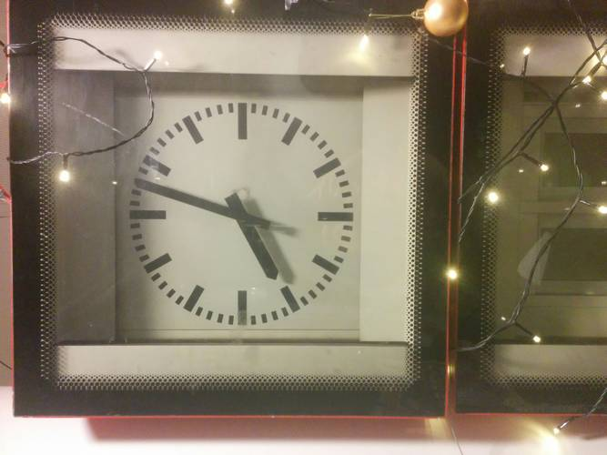
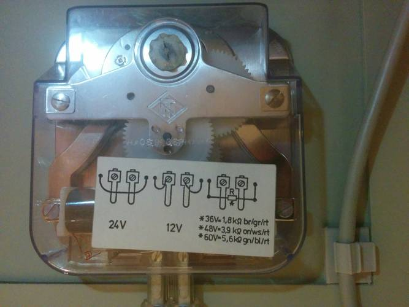

metro station display clock driver
==================================

The analog clock on those old red Finnish metro station displays is driven by
12 V pulses with alternating polarity. One pulse turns the minute hand one step
forward, and the hour hand is automatic. The required pulse duration is about
0.5 seconds. Current draw of both the two coils is approximately 50 mA at 12 V.

It's not possible to go backwards electrically, but there is a gear inside that
can be turned manually. It's also okay to just grab the minute hand.

This repo contains a super simple script that pulses two Linux GPIOs every
minute. This runs on a `Raspberry Pi`_ in AS_ guild room. Those pins are
connected directly to an H bridge. TODO: fix the circuit to use enable and
direction pins, so that it wouldn't be possible to blow up the transistors.

.. _Raspberry Pi: http://elinux.org/RPi_Low-level_peripherals#General_Purpose_Input.2FOutput_.28GPIO.29
.. _AS: http://as.ayy.fi/

